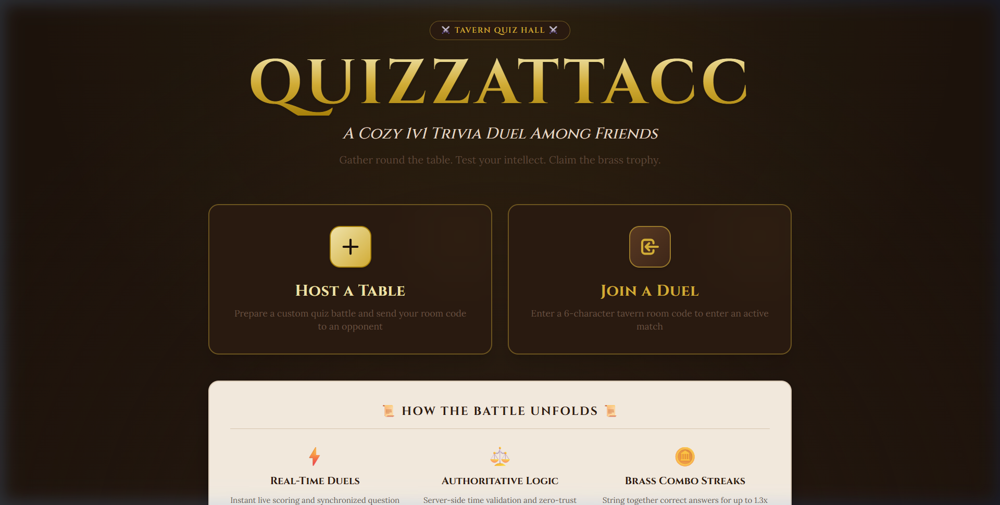
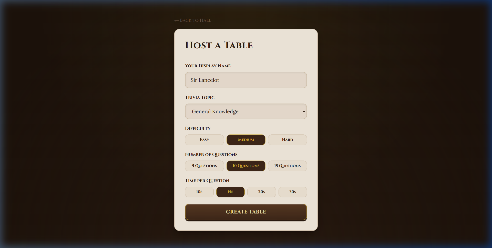
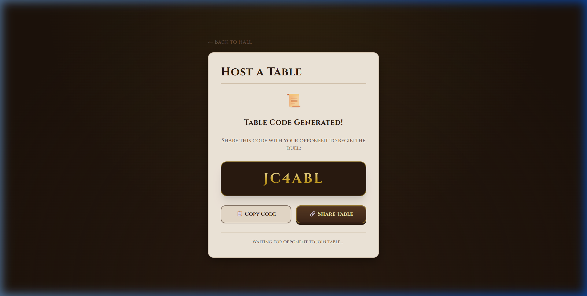
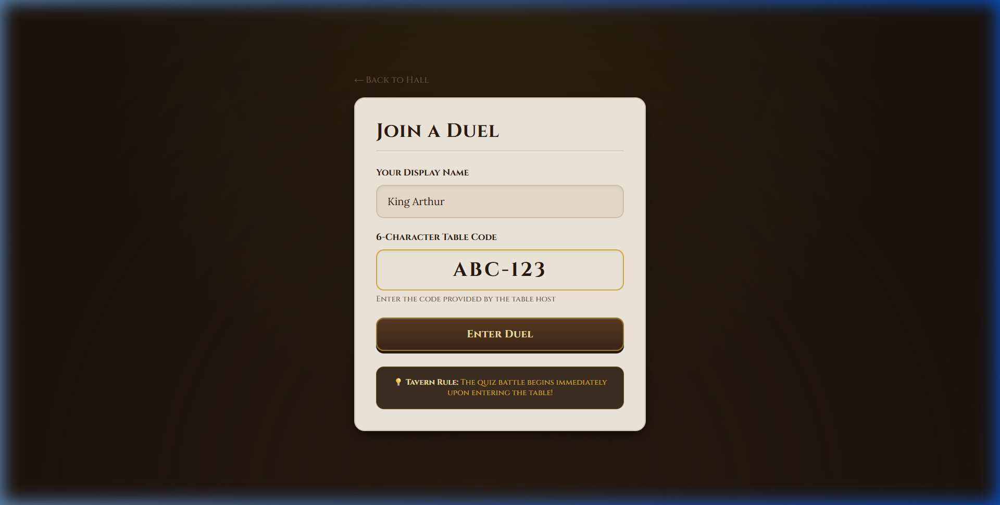

# ⚔️ QuizzAttacc - 1v1 Old-School Tavern Quiz Duel Platform

<div align="center">


**📜 Warm Timber Aesthetics • 🪙 Server-Authoritative Logic • ⚡ Real-Time WebSockets**

A production-grade, zero-trust 1v1 trivia duel platform built with a **Subtle Wooden Old-School Tavern & Board Game** aesthetic, featuring Google Fonts (`Cinzel` & `Lora`), Supabase Realtime, and Open Trivia Database (OpenTDB) integration.

[Showcase](#%EF%B8%8F-application-showcase) • [Features](#-features) • [OpenTDB Integration](#-opentdb-integration) • [Architecture](#-architecture) • [Database Setup](#-database-setup) • [Deployment](#-deployment)

</div>

---

## 🖼️ Application Showcase

<div align="center">

### 🪵 Tavern Quiz Hall Landing Page
*Warm mahogany timber table backdrop (`#1C120B`) with gold-embossed Cinzel serif headings & parchment rule scrolls.*



<br/>

### 📜 Host Table Setup & Room Code Generation
*Customizable duel rules ledger (topics, difficulties, question counts, and speed limits) generating a 6-character gold room code.*

| 🛠️ Room Setup Form | 🪙 Table Code Generated |
| :---: | :---: |
|  |  |

<br/>

### ⚔️ Join a Duel
*Carved parchment entry ledger for guests joining an active trivia table.*



</div>

---

## 🎯 Features

### 🪵 Aesthetic & UX Design
- **Subtle Wooden Tavern Theme** — Rich mahogany timber table backdrop (`#1C120B`), aged parchment paper cards (`#F5ECE0`), polished wood tile answer buttons (`#5A3A23`), and metallic brass/gold highlights (`#D4AF37`).
- **Classic Typography** — **Cinzel** serif headings for game titles and score boards paired with **Lora** literary serif for question reading.
- **Dynamic Micro-Animations** — Smooth timer countdowns with color stroke transitions, streak multiplier alerts (`🪙`), and live victory scroll summary stats.

### 🛡️ Core Gameplay & Anti-Cheat
- **Real-Time Duels** — Synchronized question progression and live WebSocket score updates via Supabase Realtime channels.
- **Server-Authoritative Validation** — All answer scoring, speed bonuses, and streak multipliers are calculated server-side in Deno Edge Functions.
- **Anti-Cheat Audit Trail** — Submissions track server timestamps and response times (`time_taken_ms`) with a 200ms network latency buffer.
- **Metallic Streak Multipliers** — Build correct answer streaks for score boosts ($1.0\text{x} \rightarrow 1.1\text{x} \rightarrow 1.3\text{x}$).

### 📚 Game Customization
- **5 Topics**: General Knowledge, Science, History, Pop Culture, Sports.
- **3 Difficulties**: Easy, Medium, Hard.
- **Flexible Rules**: Choose 5, 10, or 15 questions per match with 10s, 15s, 20s, or 30s question timers.

---

## 🌐 OpenTDB Integration

QuizzAttacc features dual-layer integration with the **Open Trivia Database (OpenTDB)**:

1. **870+ Pre-Seeded SQL Migration** ([`supabase/migrations/2026021601_seed_questions.sql`](supabase/migrations/2026021601_seed_questions.sql)):
   - Generated via automated fetching script ([`scripts/fetch-opentdb-questions.js`](scripts/fetch-opentdb-questions.js)).
   - Automatically decodes HTML entities (`&quot;`, `&#039;`, `&amp;`, `&eacute;`) and shuffles answer choices into 4 options.
2. **Dynamic On-Demand Edge Function Fetcher**:
   - Built directly into the `join-room` Edge Function.
   - If a custom room requests questions for a topic/difficulty tier that is under-represented in the database, the Edge Function automatically queries OpenTDB on the fly, saves the questions, and attaches them to the duel!

---

## 🏗️ Architecture

### Tech Stack
- **Frontend**: React 18 + TypeScript + Vite + Tailwind CSS
- **Backend**: Supabase (PostgreSQL + Realtime + Deno Edge Functions)
- **Auth**: Flexible guest sessions with optional Supabase Anonymous Auth
- **Routing**: React Router DOM v6 + `vercel.json` SPA rewrites

### Database Schema
```
players ───► rooms ───► matches ───► match_questions ───► questions
                           │
                           ├───► player_answers
                           ├───► match_scores
                           └───► match_summaries (Auto-Generated via DB Trigger)
```

### Security Model
```
Client (Sends Intent) ──► Serverless Edge Function (Audits & Validates) ──► PostgreSQL (State Write) ──► Realtime Channel (Broadcast)
```
- **Zero Trust**: Client code never handles correct answer indices or scoring math.
- **RLS (Row-Level Security)**: Enabled across all 8 database tables.
- **Automated Summary Trigger**: `generate_match_summary()` automatically computes accuracy and time statistics upon match conclusion.

---

## 🚀 Database Setup

### Prerequisites
- Node.js 18+ and npm
- Supabase Account ([supabase.com](https://supabase.com))

### 1. Execute SQL Migrations
In your Supabase Dashboard (**SQL Editor** $\rightarrow$ **New Query**):
1. Run [`supabase/migrations/20260216_initial_schema.sql`](supabase/migrations/20260216_initial_schema.sql) (creates tables, enums, triggers, and RLS policies).
2. Run [`supabase/migrations/2026021601_seed_questions.sql`](supabase/migrations/2026021601_seed_questions.sql) (populates 870 OpenTDB trivia questions).

### 2. Deploy Edge Functions
```bash
# Link your project (replace with your project ref)
npx supabase link --project-ref your-project-ref

# Deploy all 4 serverless edge functions
npx supabase functions deploy create-room
npx supabase functions deploy join-room
npx supabase functions deploy submit-answer
npx supabase functions deploy cleanup-expired-rooms
```

### 3. Local Development Configuration
Create a `.env` file in the project root:
```env
VITE_SUPABASE_URL=https://your-project.supabase.co
VITE_SUPABASE_ANON_KEY=your-anon-publishable-key
```

### 4. Start Development Server
```bash
npm run dev
```

---

## 📦 Deployment (Vercel)

This repository includes a pre-configured [`vercel.json`](vercel.json) file for Single Page Application (SPA) routing.

1. Import your GitHub repository into **[vercel.com](https://vercel.com)**.
2. In **Environment Variables**, add:
   - `VITE_SUPABASE_URL`: Your Supabase Project URL
   - `VITE_SUPABASE_ANON_KEY`: Your Supabase Anon Public Key
3. Click **Deploy**!

---

## 🎮 How to Play

1. **Host a Table**:
   - Click **Host a Table**, enter your display name, choose a topic, difficulty, question count, and time limit.
   - Share the generated **6-character table code** with your opponent.
2. **Join a Duel**:
   - Click **Join a Duel**, enter your display name and the table code.
3. **Battle**:
   - Answer questions rapidly on carved wooden tiles.
   - Earn base points ($100$) + speed bonuses (up to $50\text{ pts}$) $\times$ combo multipliers ($1.0\text{x} \rightarrow 1.1\text{x} \rightarrow 1.3\text{x}$).
4. **Victory Ledger**:
   - View detailed match statistics, accuracy %, and average response speed on the victory parchment scroll!

---

## 📄 License

Distributed under the MIT License. See `LICENSE` for details.
