# Quizexe Event Flow Diagrams

## Game Lifecycle Overview

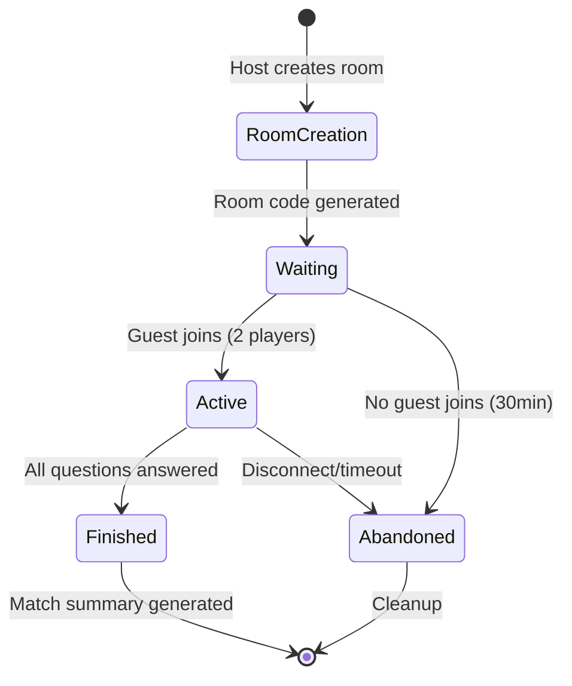

## Detailed Player Flow

### Host Flow
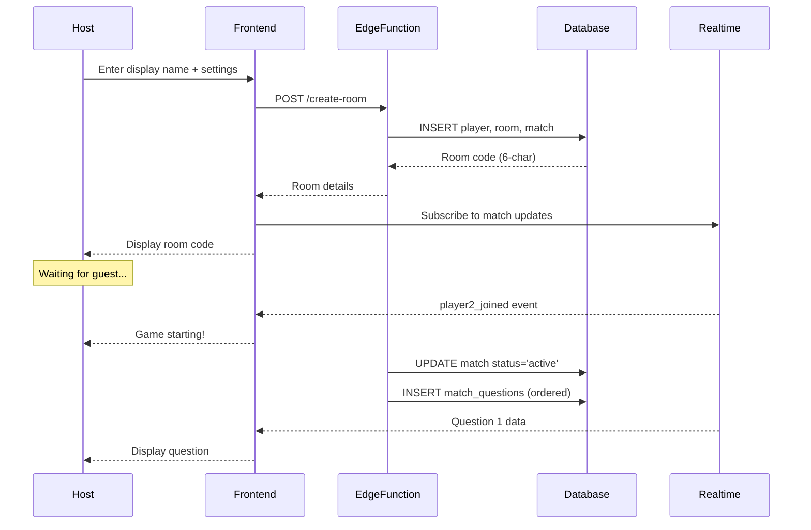

### Guest Flow
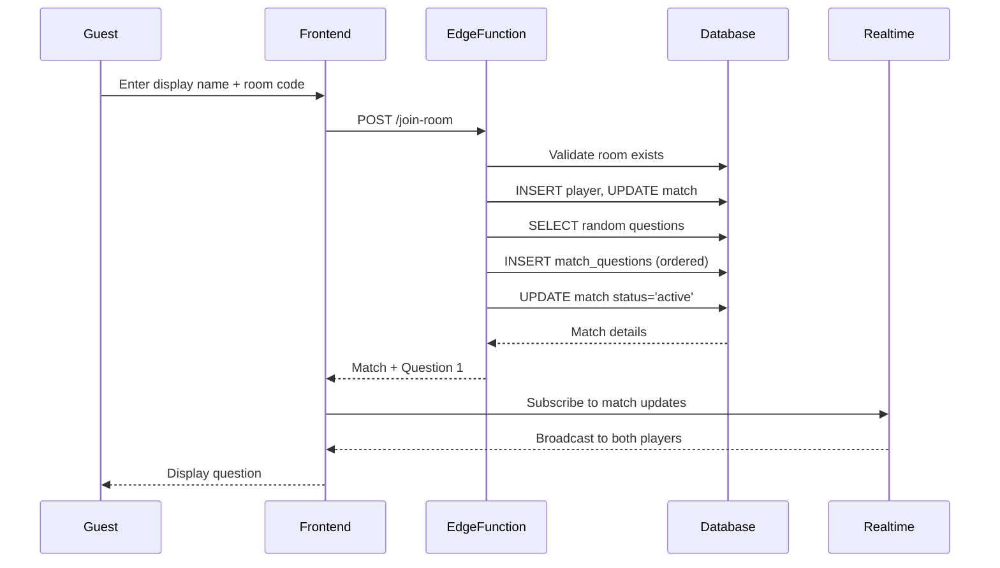

## Question Answering Flow

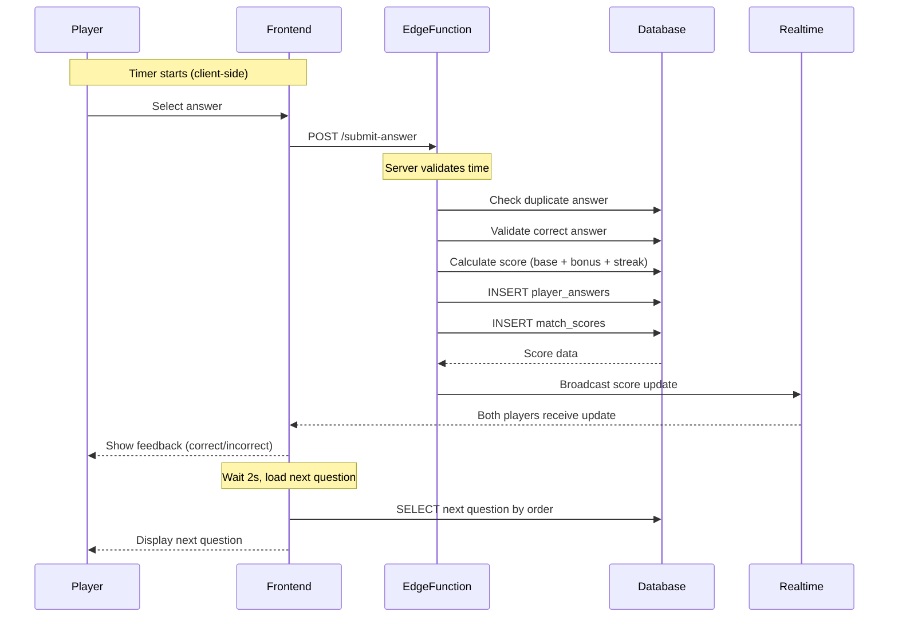

## Scoring Calculation (Server-Side)

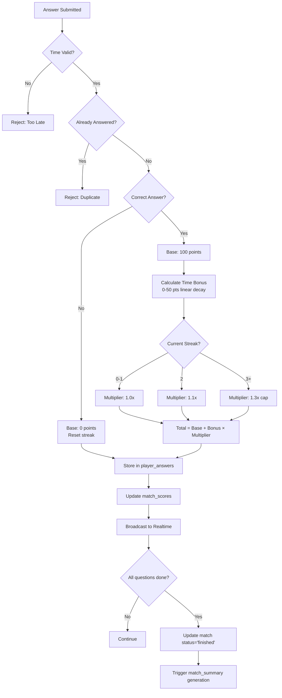

## Latency Compensation

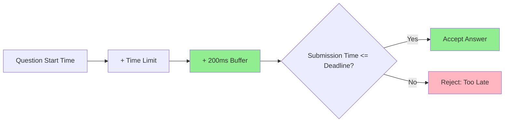

## Match Completion Flow

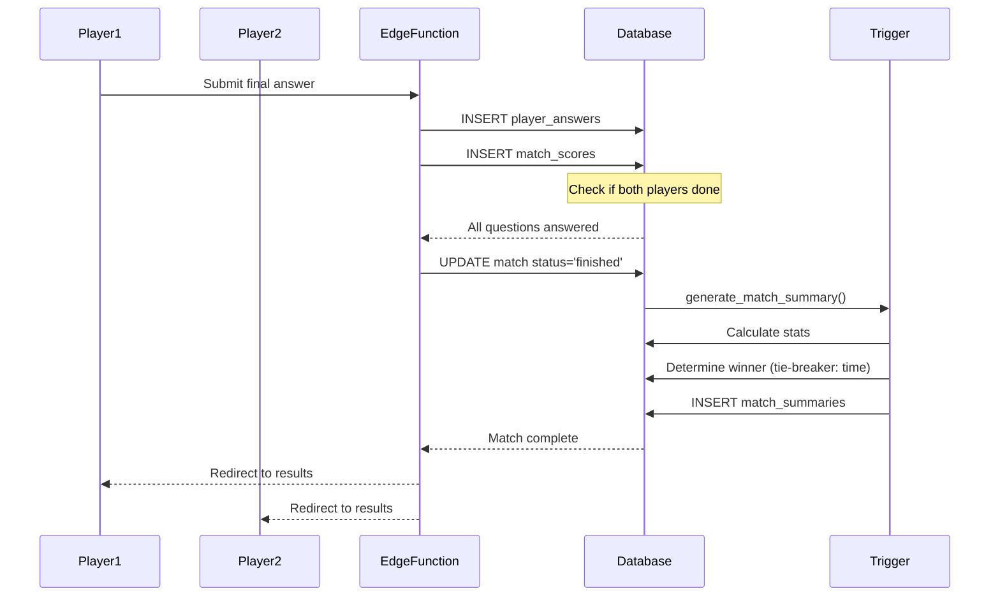

## Reconnection Handling

```mermaid
flowchart TD
    A[Player Disconnects] --> B[Realtime detects]
    B --> C{Match Status?}
    C -->|waiting| D[Show "Opponent disconnected"]
    C -->|active| E[Continue game for connected player]
    C -->|finished| F[Show results]
    E --> G[Player Reconnects]
    G --> H[Frontend checks match_id in localStorage]
    H --> I[Query current question by order]
    I --> J[Query current scores]
    J --> K[Resume at correct question]
    K --> L[Sync timer from server]
    
    style K fill:#90EE90
```

## Cleanup & Expiration

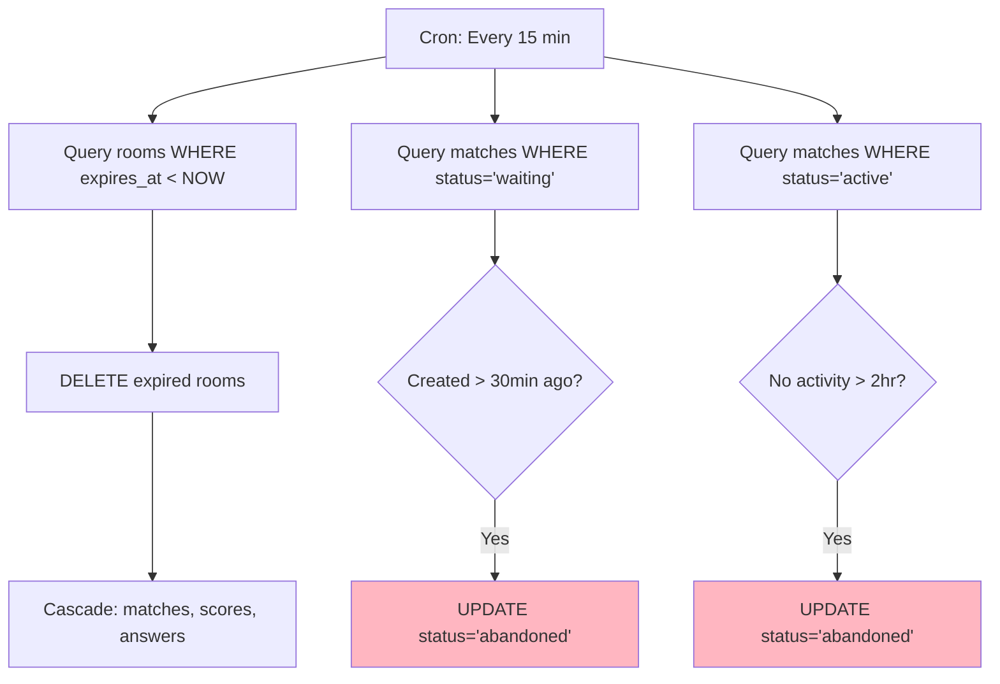

## Anti-Cheat Validation

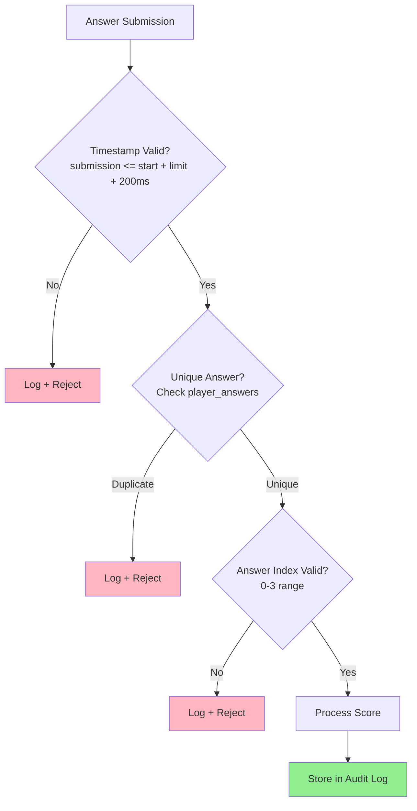

## Database Trigger Flow

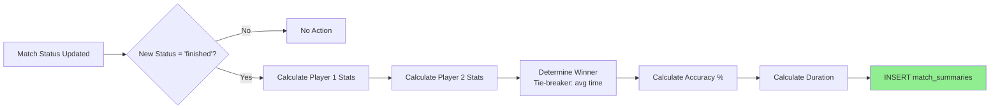

## Realtime Event Types

### Database Changes (Supabase Realtime)
- `matches` table: `status` updates (waiting → active → finished)
- `match_scores` table: Score updates after each answer
- `player_answers` table: Answer submissions (for opponent feedback)

### Broadcast Channels (Ephemeral)
- `match:{match_id}:timer` - Timer synchronization
- `match:{match_id}:presence` - Player connection status
- `match:{match_id}:events` - Game events (question transitions, etc.)

## Security Boundaries

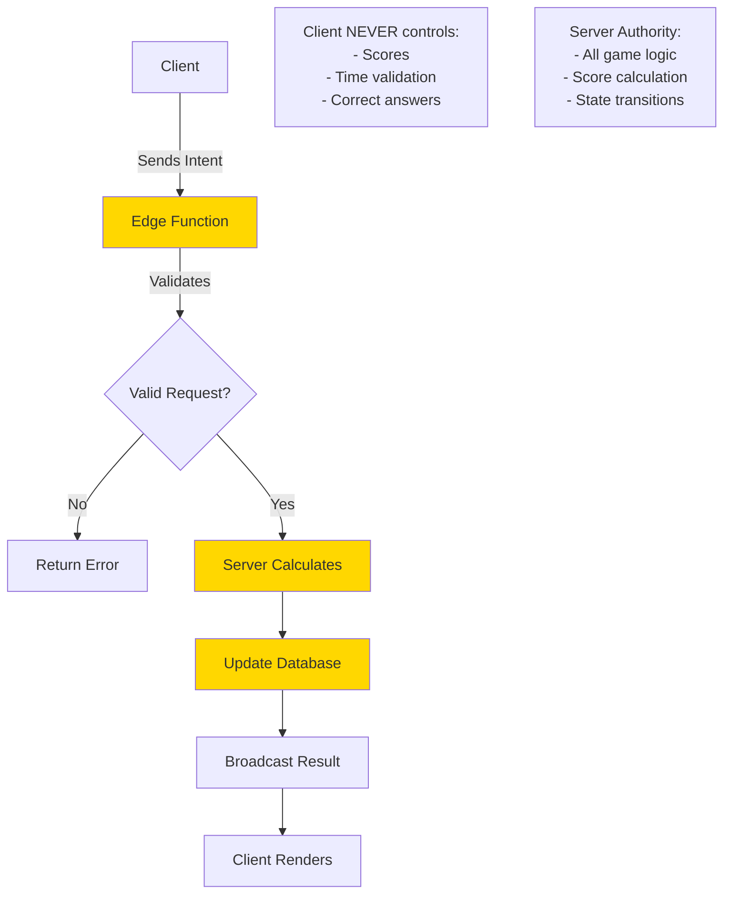
